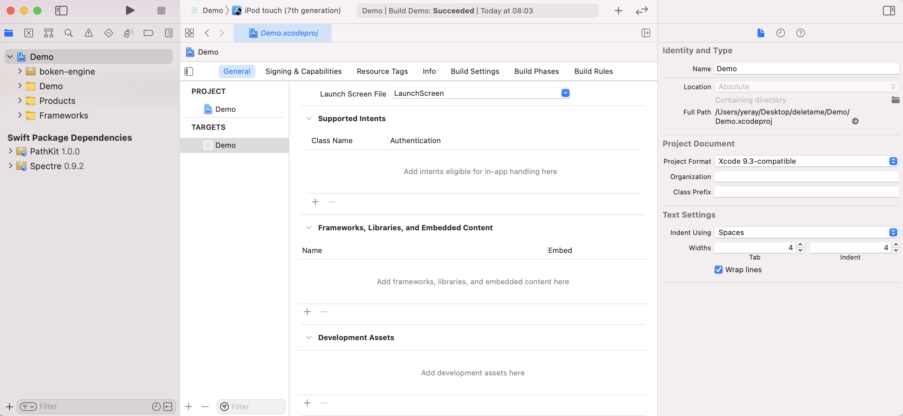
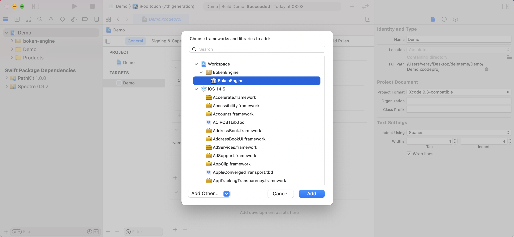
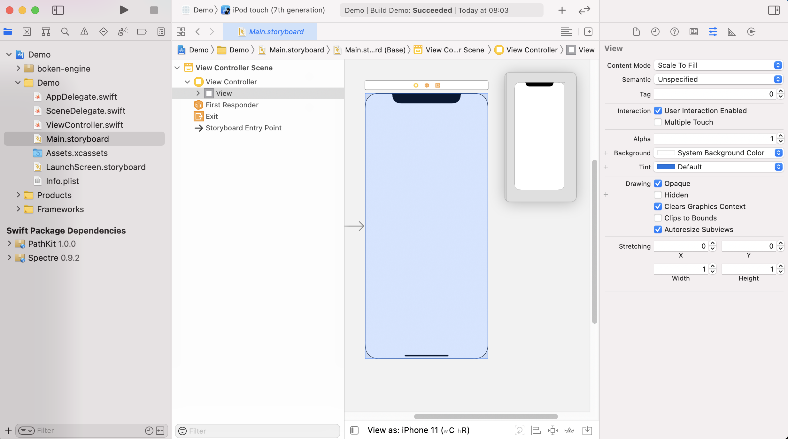

# Boken Engine
  

An iOS/MacOS Swift Package for creating slides-based, non-linear visual stories and presentations.

https://www.boken-engine.dev

## 1. Description

BOKEN (from Swedish: The Book; also from Japanese 冒険 - Bōken: Adventure) ENGINE is a Swift Package with which any user, only with a few lines of codes, can generate full fledged visual stories or slide based presentations for iOS and MACOs devices. It is based on SpriteKit.

The user just has to provide a human readable JSON description with some predefined properties, the image and sound assets, and initialize the framework within the project with just a few lines.

## 2. What is it intended for?

- Creation of [Visual Novels](https://en.wikipedia.org/wiki/Visual_novel) or [Gamebooks](https://en.wikipedia.org/wiki/Gamebook).
- Creation of slide-based presentations (academic explanations, promotional material...)
- Creation of artistic portfolios 
- Creation of marketing slide shows

## 3. Technical pre-requirements

- XCode version 11 (iOS SDK 13) or later 

## 4. Necessary knowledge

Boken Engine is targeted to both experienced programmers and people that wants to create their own App but does not have lots of coding knowledge.
Those are the basic skills a user needs to have in order to use Boken Engine:

- Know how to create a XCode project and how to use the XCode UI
- Know how to link the Package (this is explained on the next section)
- If the application is to be published, know how to do it (although there are lots of pages detailing how to do this)

Once the project is created and the Package is linked, a few lines of code must be written, as is explained in the next section.

## 5. Dependencies

Boken Engine uses built-in iOS libraries UIKit, SceneKit and SpriteKit and [PathKit](https://github.com/kylef/PathKit).

## 6. How to use it

Boken Engine is not a stand-alone application. This is a Package: a piece of software intended to be used within another Application that will make use of its features.

### 6.1. Basic usage

1. Create your project using XCode. Select iOS App template.


2. Choose options for your new project. Set a Project Name, Organization Identifier and be sure you select "Storyboard" option for Interface, "UIKit App Delegate" option for Life Cycle and "Swift" option for Language.


3. Now you can see basic structure for your new created project on Project Navigator tree.


4. Link the package with your project. You can do it manually or using Carthage/CocoaPods if you prefer.

    - Download Boken from its [source repository](https://github.com/boken-engine/boken-engine). Save it in any folder of your hard drive.
  
    - On the project you want to link Boken, drag and drop the Package Folder to anywhere within the Project Navigator tree.

        

    - Add the library to the "Link Binary with Libraries" section of the target's Build Phases tab, using the "+" icon

        

    - On the pop up screen you should see BokenEngine available to be added. Just click on the "Add" button to link it to your project.

        


5. Initialize the Package for its usage with two final steps:

    - Instantiate SceneManager class.

        The main class of the Engine is the SceneManager. To use the engine, just instantiate it, pass your application root view to it, and call the Title Scene loader.
        Typically, this is done in the viewDidLoad method of the ViewController class (ViewController.swift file) this way:

        ```swift
        import BokenEngine

        class ViewController: UIViewController {
            override func viewDidLoad() {
                super.viewDidLoad()

                // Boken Engine initialization
                let sceneManager = try! SceneManager()
                sceneManager.setRootView(self.view)
                try! sceneManager.loadTitleScene()
            }
        }
        ```

    - Set SpriteKit capabilities on Main view class

        The view in which the contents are to be created must have SpriteKit capabilities, the library Boken Engine uses for all content rendering.

        In order to accomplish this, the Main View instance must have SKView class. To do so:

        - On the project navigator, click on the main view storyboard (by default, "Main.storyboard")
        - Click on the View element, usually under the "View Controller Scene" and "View Controller" elements.

        

        - Click on the Identity Inspector and change the Custom Class to "SKView".

        

6. Create the contents file and put it along with the image/audio assets into the project (see "6.2. Content creation" section).
7. (optional) Add any additional feature to your application.
8. Publish your application.

### 6.2 Content creation

We suggest putting all the specific content of the application (Story description + Image files + Audio files) into a separate folder within the application structure, but this is not necessary.

The contents the application is going to show (that is: the description of all the slides) are described by a JSON file called "StoryDescription.json", and must be anywhere within the application structure.

The complete format of this file is explained in the [Content Creation Guide](doc/contents-creation-guide.md), but this is a simple example of a StoryDescription.json:

```JSON
{
    "appTitle": "My Cute App",
    "backgroundMusic": "SuperBackgroundMusicFile",
    "scenes": [
        {
            "sceneId": "TitleScene",
            "elements": {
                "elementsArray": [
                    {
                        "type": "image",
                        "imageFile": "cuteBackground",
                        "posX": 0.5,
                        "posY": 0.5,
                        "scale": 1,
                        "transformations": [
                            {
                                "type": "scale",
                                "toValue": 1.25,
                                "duration": 10
                            }
                        ]
                    },
                    {
                        "type": "textLabel",
                        "content": "Welcome to my Cute App!",
                        "posX": 0.5,
                        "posY": 0.86,
                        "fontSize": 36,
                    }
                ]
            },
            "branches": [
                {
                    "label": "Credits",
                    "target": "finalSlide"
                },
                {
                    "label": "START",
                    "target": "Slide01"
                }
            ],
            "background": "black",
            "navigation": "none"
        },
        {
            "sceneId": "Slide01",
            "elements": {
                "elementsArray": [
                    {
                        "type": "textLabel",
                        "content": "Hello World!",
                        "posX": 0.5,
                        "posY": 0.55,
                        "fontSize": 36,
                        "style": "bold"
                    }
                ]
            },
            "background": "black",
            "navigation": "next"
        },
        {
            "sceneId": "Slide02",
            "elements": {
                "elementsArray": [
                    {
                        "type": "textLabel",
                        "content": "Nice to meet you!",
                        "posX": 0.5,
                        "posY": 0.45,
                        "fontSize": 23,
                    }
                ]
            },
            "background": "black",
            "navigation": "both"
        },
        {
            "sceneId": "finalSlide",
            "elements": {
                "elementsArray": [
                    {
                        "type": "textLabel",
                        "content": "Credits: me!",
                        "posX": 0.5,
                        "posY": 0.5,
                        "fontSize": 24,
                    }
                ]              
            },
            "background": "white",
            "navigation": "back",
            "branches": [
                {
                    "label": "Start again",
                    "target": "TitleScene"
                }
            ],
        }
    ]
}

```

With the Boken Engine, this content description, along with an asset catalog with the "SuperBackgroundMusicFile.mp3" audio file and the "cuteBackground.jpg" image file, will generate a iOS App that will present to the user a first view with an image backgroung, the "Welcome to my Cute App!" label and two buttoms: "Credits" and "Start". If the user clicks on "start", the second slide (the one with the "Hello World" slide) will show up. If the user clicks on the right side of the screen, the third slide will be presented.

For more information about content creation, refer to the [Content Creation Guide](doc/contents-creation-guide.md).

### 6.3 How to run tests

To run the Package tests, open its project on XCode and press Command + U. More about running tests and checking results can be found on the [official Apple documentation](https://developer.apple.com/library/archive/documentation/DeveloperTools/Conceptual/testing_with_xcode/chapters/05-running_tests.html). 

### 6.4 How to write and run additional tests

We use the [XCTest Framework](https://developer.apple.com/documentation/xctest) for unit testing. New tests to increase code coverage will be welcomed. Please refer to the [Contribution Guidelines](CONTRIBUTING.md) to comply with coding standards.

### 6.5 Advanced usage

#### 6.5.1 Adjustments for horizontal (landscape) device orientation

The position, scale and font size attributes in the JSON contents description file can be overloaded using "H" suffix. This way, each element will have a position and size on vertical (portrait) device orientation and anothar one on horizontal (landscape) orientation.

#### 6.5.2 Contents description passed as a string

If the Scene Manager is initialized with a string, instead of fetching the JSON story contents from the default file path, the string will be parsed as the story contents. This way the contents can be dinamically generated from a database or any other source.

#### 6.5.3 Transformations

The images and the text labels can be animated via "transformations". Currently, there are two kinds of transformations: scale (size) and rotation. They can be combined. Each transformation is defined by its type, the final value for the property (scale or rotation) and how many seconds it takes to reach this value. Full description of the transformations syntax can be found at the [Content Creation Guide](doc/contents-creation-guide.md).

## 7. How to contribute

New contributions will be highly appreciated! But please, refer to the [Contribution Guidelines](CONTRIBUTING.md) before submitting a Pull Request.

Those are some suggestions for new contributions:

- New elements (Video, animated GIFs, symbols...)

- More control of TextLabels (Fonts, color...)

- A visual story contents editor (this would be VERY MUCH appreciated)

- Remote retrieving of assets via URL


## 8. Frequently asked questions

- Do I need special software to write the JSON file?

No. JSON is a text-based format that can be written with any text editor. However, we suggest using an editor with highlightning and blocks collapsing features, like Sublime Text, Notepad++ or similar.

- Can I use Boken Engine with another development platform other than XCode?

Not at the moment. It relies on XCode and associated libraries (SpriteKit, SceneKit...)

- Is there any Boken-based application I can check as an example?

Yes, you can check and fork [15 Universe Facts](https://github.com/boken-engine/15-universe-facts) as a sample application. It includes a GitHub Actions workflow that builds and generates an IPA file.

Also, please check (and enjoy) [Iakkai Saga: The Curse of Blood](https://github.com/boken-engine/iakkai-saga-the-curse-of-blood), a fantasy-packed adventure game full of nice art and a captivating story.

- Can I use it for commercial projects?

Yes, you can, but please, check the [License details](LICENSE) to know the details.

## 9. License

The Boken Engine Package is available under the [Mozilla Public License Version 2.0](https://mozilla.org/MPL/2.0/).

If you want to know more about this choice you can check the documentation about this on [choose-a-license.md](/doc/choose-a-license.md).
