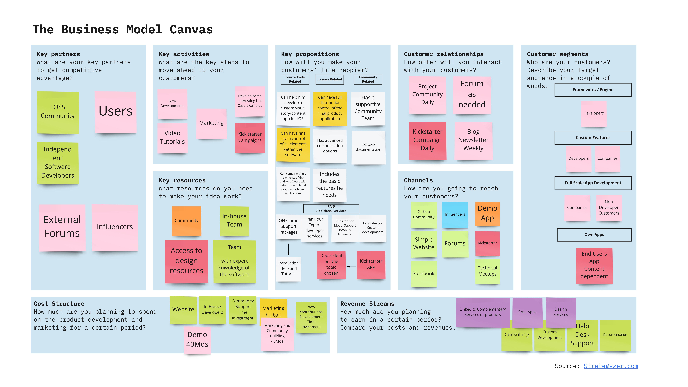

# BOKEN ENGINE – Proposed Business Model

### Objective of the proposed business model canvas

The objective of the proposed canvas is to reflect what is possible and what elements are relevant to be considered in this model.  The proposed elements are assumptions that will need to be validated and which have been made upon the previous research done on this topic by our team.

For the current proposed business model, the following considerations have been considered:
-	Project License & Philosophy
-	Current state of the software
-	Current objectives of the project
-	Available resource limitations

### License & Philosophy
-	One of the main objectives of the project is to make our solution available to all and have people contribute and evolve it for the benefit of everyone who wants to use it.
-	MPL Licensing options grants the possibility to also use the code and expand it clearly differentiating the proprietary code from the free open-source code.
-	We want the project to become a relevant and useful tool for our users so that we will add new features based upon cumulative future requests and inquiries or financial support received for specific purposes.
-	If you want to make money using Boken Engine you can do so and should not be hampered in doing this, leaving the door open to different options for the creation of additional paid and unpaid features by the Boken Team and other developers.

### Current state of the software
-	The Boken Engine software now (2021 March) does not have any visual user interface and requires both for install and productive use development skills, which excludes non developers from using it on their own. The current proposed business model reflects this fact and is built upon this underlying condition.

### Current objectives of the project
-	The current objective for us is to make advertise and make our project known to the public be they developers or end users. 
-	To incentivize developers to contribute and use the Boken Engine.
-	To capture the attention and display the potential of this solution.
-	To further develop its features and usability.
-	To cover costs.
-	To test the different elements of the business model.
-	To create a beautiful Demo that will display all the current potential of Boken Engine.

## Proposed Business Model
The proposed business model is a combination of the researched business models and an idea of crowdsourcing funds through the creation of our own demo apps as a form to create and display the potential of our tool.

The two main business models that we believe can be employed are the standard Support Service Model and the Related Services or Products model which are feasible with the chosen MPL license.

For the model to cover costs at first, and in the future to become profitable to further explore and expand it, it is essential to keep it as open as possible and that we make high quality examples of what can be achieved with our solution to incentivize adoption.
Each of the elements will be explained in more detail below.

### Customer Segments
These are the initial customer groups that we can aim at given the state of the software and based upon the services and products that we can deliver right now with a reasonable effort and considering our own available resources.

### Customer relationships
The relationships with contributors and the users that we can currently address through the different platforms that are either already set up or can be set up.

GITHUB community a related forum and a website or blog of the project to keep people updated on the progress. Initially the effort will be minimal except for the technical setup of the various elements in this section. At a later stage when more people join the effort will increase, for instance the Project Community of contributors etc. will have to be daily, a blog letter should if possible be weekly.

On the other hand, if we are to run a Kickstarter Campaign, we will have to prepare to interact daily to take care of followers and buyers.
Channels 

These are the points of contact with potential customers and contributors.
We believe that the main channels are going to be digital and online, most of them being free and with no monetary cost except for the time we will have to dedicate to this task.

The ones that we believe will be free are marked in light Green.
The Demo app can be seen as a channel two since it will help us reach customers through branding it and including links to our website, Github etc. The requirement of time for this app we estimate it to be 40 MDs.

Depending on whether we decide to launch a Kickstarter Campaign this has the potential to be sales and promotion channel for the project that could reach End Users of this type of final apps.

### Key propositions - Value Creation 
These are the main benefits of using Boken Engine for the different customer Groups and the services that will be provided. For better understanding we have divided them in areas:
- Source Code Related
- License Related
- Community Related

### Key Activities
The relevant activities to engage to make the model work are the tasks or things that we need to engage with and accomplish.
Here we believe that it is going to be, such as developing Boken Engine more, develop support material such as video tutorials, documentation, basic marketing, through the mentioned channels. 

### Key Resources
These are the elements that are essential to our activities, our experts the community and design resources for any app that we will make, and which will have to be found.

### Key Partners 
To gain competitive advantage we heavily rely on our success to create a large community of contributors and users, in addition to sufficient adoption of Boken Engine so that independent software developers start to adopt it for work related issues.

### Cost Structure
This section reflects the approximate costs in time that we expect to have during the coming three 4 months, and the cost streams, our own in-house developers, etc.

Also, I have indicated the possibility of a marketing budget, depending on the internal funds that we will get access to.

### Revenue Streams
For the coming 4 months no revenues are expected.
The intention and main goals are to create a steady flow of revenues to support the continuing growth of Boken Engine. The main volume if we adhere to this business model and gain traction will come mostly from support services such as consulting, custom developments, support and documentation.

As a second potential stream we think that it is interesting to explore Kickstarter crowdsourcing.

If we are able to launch and successfully run a Kickstarter campaign to promote our own apps we could expect a certain amount of revenues also from this source.

We believe that a Kickstarter Campaign for the creation of the High-Quality Demo App is a way that we can explore since it can help us meet several goals at once:
-	Create publicity for the project over the Kickstarter Campaign period.
-	Display the potential of the potential of the Boken Engine.
-	Market research as to the features that end users, the consumers of apps made with Boken Engine would like to see and value.
-	Create revenues to continue our work Boken Engine and grow our community.

## Future evolution of the software and business model
The future evolution and roadmap of the software will shape the additional elements that will be included in the business model. 

For instance, if the project improves its usability and ease of installation in the future End Users will not require any development skills to install and use the Boken Engine.

This for example would open additional possibilities to expand the number of potential users and help its adoption and growth. 

Also, no business model is fixed in stone, it is an evolutionary system which evolves to serve the needs of customers and also adapt to market conditions; therefore, it is always open to change.

