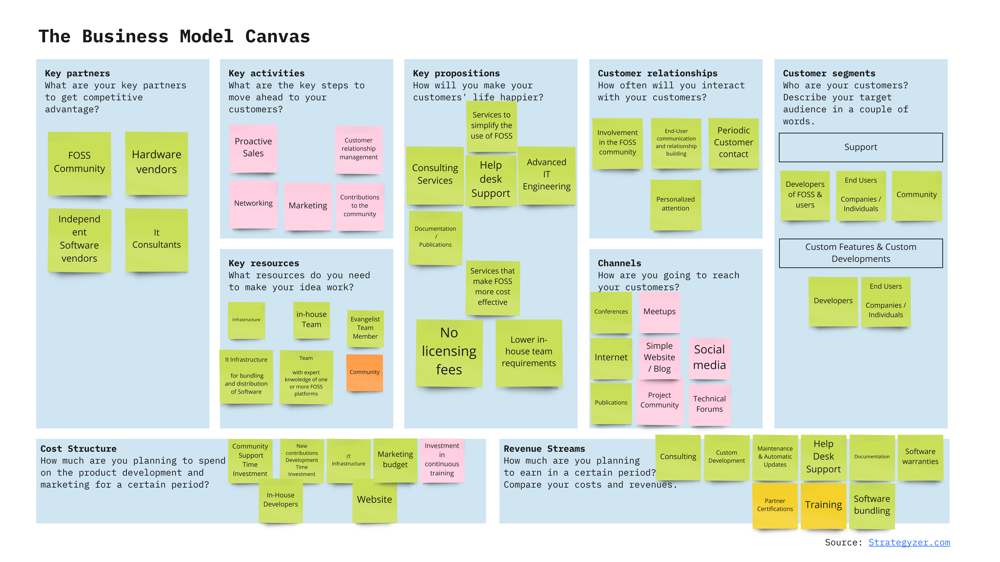
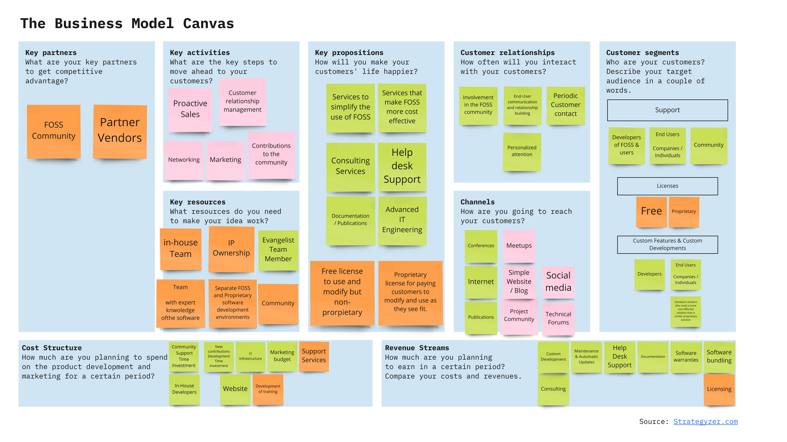
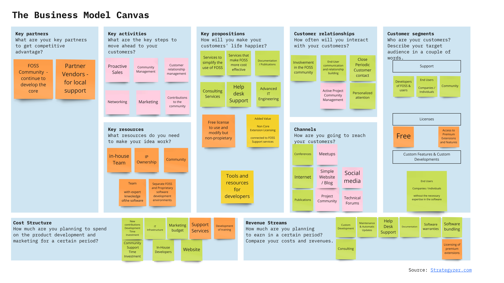

<h1>1.5 Business Model and Monetization Options for Open-Source Software Projects (OSSP)</h1> 

One of the major decisions to be made when considering an OSSP is the license under which it will be launched since the license will directly affect the business models that can be constructed around it. The license element is also heavily affected by the ideological stance that the authors take.

On the other hand, there exists also the possibility to follow a dual licensing strategy which, however, is not always the right choice depending on the OSSP owners pursued goal and ideology.

In essence one can say that a great part of OSSP business models generally focus on services related to the use of their OSSP software, this however, stemming from the ideological advocates that Open-Source Software should be free in all aspects.

<h2>1.5.1 Impact of Ideology on the creation of a Busines Model</h2>

When it comes to the ideology there exist essentially two different definitions for Open-Source Software. One definition advocating that Open-Source Software should always be free and the other leaving the door open to charging for Open-Source Software.

One side represented by the Free Software Foundation (FSF) advocates the GNU-GPL licensing approach and philosophy and defines software freedom to have 4 essential elements (http://www.gnu.org/philosophy/free-sw.html):
•	Freedom to run a program anytime and for any purpose.
•	Freedom to study how the program works and be able to adapt it to your needs.
•	Freedom to re-distribute copies.
•	Freedom to improve the code and release any improvements that you have made to the public.

In addition to these 4 points, it is also considered that a reasonable distribution fee for the distribution of the Open-Source Software and its manuals can be charged. However, the software should be considered by this party as essentially free with no additional cost.
The FSF ideology is also reflected in the GPL licensing approach which stands for these values and demands that any contribution and changes to any underlying project to this license be made public.

On the other side stands the Open-Source Initiative (OSI) which advocates 10 criteria (https://opensource.org/docs/osd) similar in many aspects to the FSF but it also makes a point in that not all Open Source software will be 100% free of usage restriction, such as defined by the FSF. The OSI leaves thus the door open the commercialization of any underlying software as a product, thus expanding the possible business model and sources of revenue that a OSSP can consider. 
1.5.2 The Nature of Software and its possible Business Models 

Software is essentially a different good or product if compared to more traditional products and services. Software is different in that it can be easily modified, copied, and distributed and that it is not physical, so that software producers can offer a wide range of products and features with little extra cost and with different pricing models. 

These qualities make it crucial to consider the licensing question from the start for intellectual property protection when considering business models.
In addition to this the real value that customers derive from it stems from its use and its worth can only be assessed once the software has been tried. 

Customer loyalty in software is often tied to the potential switching costs which is essentially the time & money spent on learning and maintaining the software.
On top of this all stakeholder in the distribution chain are linked creating dynamic network effects. Vendors, partners, and customers are linked when it comes to the determination of the overall value of the software. The more people use it, provide it and distribute it the more cumulative value it has. 

Some obvious examples to show these network effects would be:
•	A software that does not have users is of no value or interest to be distributed nor sold or maintained by companies.
•	A software that does not have a network of partners cannot offer good support solutions to companies.
•	A software whose vendors are few, is difficult to get, expand, etc.

The nature of software creates a challenge in the conception of a viable business model such as happens with any new technology, research, or innovation where it can be the case that the market is not ready yet and no current customer need exists for it. Thus, if one intends to create a viable business model one must focus on delivering to an already existing market need or must create a new market for it, which can be a long and costly path. 

<h2>1.5.3 Essential activities that software companies generate value with</h2>

The activities through which software companies generate value are basically these:
•	Services
•	Product centered services
•	Products
•	Products distributed as services (SAAS)
Each activity having its different specific implications in terms of the offer, customers, market approach, etc. that can be summarized in the following table:
 

<h2>1.5.4 Value Creation Activities and Revenue Potential</h2>

Essentially OSSP software producers and any software company can consider the following representation 	to envision the revenue potential grossly and where they could fall into:
 
Depending on the choice of business model and licensing the possibilities will move along the given axis. 

<h2>1.5.5 Possible Business Models</h2>

The business models that are available to an Open-Source Project are in essence the same as those of any other software company:
•	Support services.
•	Dual licensing.
•	Proprietary extensions or “Open Core Licensing”.
•	Leveraging OSS to sell other products or services.
Source: Martin, Donald & Foulonneau, Muriel. (2014). Guide to Open Source Business Models - Leveraging a Free and Open Source Software framework to develop commercialization strategies for IT Research & Development projects. 10.13140/2.1.4393.7281.

The following business models, however, are different in their applicability depending on the chosen license and their potential customers, growth and success drivers.

<h3>1.5.5.1 Business Model: Support Services </h3>

The pure support services business model is possible for all OSSP. However, for projects that are FREE and run under Copyleft licenses such as the GNU/GPL license, these are the only possible approach.
The GPL license prevents the OSSP software to become proprietary and sold at considerable margins since its source code and modifications must always be freely available and no vendor can generate a differentiation based on the code.
This fact creates an interesting situation where the software has almost no cost for customers and companies must create income through their complementary service offering. 

<b>Customers</b>

Below is a simple overview of the three generic customers with the possible services from a FREE OSSP vendor:
 
Source: Martin, Donald & Foulonneau, Muriel. (2014). Guide to Open-Source Business Models - Leveraging a Free and Open Source Software framework to develop commercialization strategies for IT Research & Development projects. 10.13140/2.1.4393.7281.

<b>Growth and Success Drivers</b>

When considering the market growth drivers and potential we first must consider the customer base, and who else is competing with us. In the case of the different FREE OSSP the competition is on two fronts, other FREE OSSP providers and proprietary software providers. 

The challenges here are twofold, to move away customers from proprietary solutions and to differentiate effectively from other FREE OSSP vendors.
 When it comes to the drivers for success, they are dependent on the competitive environment:
 
<i>Source: Martin, Donald & Foulonneau, Muriel. (2014). Guide to Open-Source Business Models - Leveraging a Free and Open-Source Software framework to develop commercialization strategies for IT Research & Development projects. 10.13140/2.1.4393.7281.</i>

In addition to this there is an inherent factor that defines the success or failure of the support service model: the growth and popularity of the OSSP. 
If the OSSP software does not convince customers as the better solution for their software needs, the support service model will unlikely become a viable option. 

<u>Examples</u>
Linux kernel – (RED HAT, NOVELL, CANONICAL)
 
<b>BUSINESS MODEL CANVAS: SUPPORT SERVICES</b>
]

<h3>1.5.5.2 Business Model: Dual Licensing</h3>

The dual licensing model is in essence that there exist two sets of code one freely available and one proprietary that is made available in exchange for payment, or that the customer buys the rights to modify the code for commercial purposes and does not want to make public any improvements made to the code. Copyright law gives the author of the work the right to license however they wish to whomever they wish. 

<b>Customers</b>

The same customers apply as for the support services model who through dual licensing can get access to closed code not freely available or they request for custom developments that they want to be proprietary. 

<b>Growth and Success Drivers</b>

Overall development costs of the software in comparison to other proprietary solutions are lower since much of the development and testing have been done FOSS community. This allows the copyright holder to offer lower cost pricing models to attract customers away from similar proprietary solutions. 

The offered solution must be perceived as a superior or equal technical solution to other commercial and FOSS software alternatives. In addition, to this the dual licensing approach opens the possibility to offer advanced consulting and or development services to companies who want their own custom solutions based on the OSSP solution, but do not have the necessary expertise in-house.

Also, dual licensing can be applied in combination with other business models such as the support services for the Free code. Where for example the company can provide all the services from this model to the free version of the code.

Clear separation of the two code versions, proprietary and FOSS.
Procedures in place to avoid the proprietary code “contamination”, like assigning establishing the procedure that contributors must first assign the copyright to the owners of the project before any contributions are accepted.

<u>Examples</u>
MYSQL
Apatar
Pentaho

<b>BUSINESS MODEL CANVAS: Dual Licensing</b>

  
 
<h3>1.5.5.3 Business Model: Proprietary extensions or “Open Core Licensing”</h3>

The Open Core business model is the creation of an OSSP base solution to a problem or need that is free.  This “core” application already creates significant value but it can be amplified through non – open-source, proprietary extensions or components from vendors.

<b>Customers</b>

The same as for any software company in the previous business models, developers, companies, institutions and individuals.

<b>Growth and Success Drivers</b>
Key for success is to establish the elements that are to be contained in the Open Core solution as a minimum viable value solution and which elements will be available for a fee.

Another challenge for a company pursuing this business model is which strategy they will employ to handle the customers’ fears of vendor lock-in, when wanting to access advanced solutions or additional features. This fear is one of the reasons why some customers choose Open-Source solutions since they do not want to rely on a single vendor.

An approach for example to overcome this fear can be seen in the strategy of some companies. These companies start charging a fee for additional extensions or components which then however, at a later stage are moved gradually to the open-source version. Key in this case is that the company must have control over the IP of the community developed version and the additional components developed “in-house.”

The success of this model is enhanced if the vendor of complementary proprietary code is also the key supporter of the Free Open-Source Community.  

<u>Examples</u>
Mindtouch
Docker
Elastic
Gitlab
MongoDB
Redis

<b>BUSINESS MODEL CANVAS: Proprietary extensions or “Open Core Licensing”</b>
  

  
 
<h3>1.5.5.4 Business Model: Leveraging FOSS to sell Other Complementary Products or Services</h3>

This model approach centers on creating income not related to FOSS services or for the software itself. Making money of the sale of goods or services that cannot not exist without the other, like:
•	Cars and fuel
•	Web browsers and UI interfaces “real estate”
•	Website CMS and hosting services
•	Hardware and its operating systems
•	Computers and operating systems
•	Servers and database management software
•	Mobile phones and their operating systems

This approach can take many forms among others: 
-	SAAS (Software As A Service) platforms which are a method of software delivery and licensing in which the software is accessed online via a subscription, rather than bought and installed on individual computers.
-	The creation of products or services which are related to it like hardware that uses the FOSS.
-	The sale of related digital “real estate”.

<b>Customers</b>

The customers for this model depend on the market need that the underlying FOSS software fulfills.

The customers can be everyone from private to professionals, individuals, companies, and other institutions.
For example, one of the main incentives for customers to use this type of solutions is that they can control and budget exactly the related costs. 

<b>Growth and Success Drivers</b>
For this model to work a large customer base is needed and the software run as an application needs to address a need of the target market, reason for which companies that apply it will need to have dedicated resources to develop and support the application, without impeding the additional development of related services.

It is also key for companies to understand all the licensing implications from using the open-source software. Understanding the legal implications as to how the open-source code licensing does affect the development of the related products or services is essential to prevent legal claims.  

<u>Examples</u>

<b>Complementary Products:</b>
  
<b>Mozilla.org & Mozilla Corporation (Web browser & Web browser “real estate”)</b>

Mozilla is the nonprofit organization owner of the FOSS its free product being the Firefox browser.

Mozilla Corporation is not for profit subsidiary or the Mozilla organization who gets money from companies. This way it gets funds to develop its Mozilla organization’s FOSS project.

One customer for example is Google. Google, tasks Mozilla Corporation with incorporating the Google search bar in each base product. Mozilla as a group then receives funds to develop and sustain its FOSS and community.
  

<b>Digium (PBX Producer) & Asterisk PBX FOSS</b>
Digium supports the Asterisk FOSS embedded in its electronic products, lowering its overall development, and testing costs, gaining competitiveness with overall lower costs.
  

<b>Android & Mobile Phones and Tablets</b>

Google supports the Android FOSS mobile operating system given the mobile phone market potential. Google with this strategy aims to position itself with applications and search advertising services on the mobile phone screens. The strategy works since it helps to lower overall software development costs for mobile phone hardware producers who embrace this software.
  

<b>Complementary Service:</b>

Wordpress.org & Wordpress.com (CMS & Hosting with advanced services)
Wordpress.org is the worlds most popular CMS, FOSS with a strong GPL license that does force all developments done by its community to be made public and reincorporated into the project. 

Wordpress.com however is the for-profit company of one of its authors who offers a hosting services in different subscription packages for Wordpress.org’s CMS software, and different levels of customizable services build into the service and software offer.
  
 
<b>BUSINESS MODEL CANVAS: Leveraging FOSS to sell Other Complementary Products or Services</b>

                  

<h3>1.5.6 Additional questions to be asked when establishing the possible business model or model combination.</h3>

Key questions that should be asked when evaluating a FOSS business model:
•	Does the software create a new product category or does it significantly improve upon or
challenge products in an existing product category?
•	Is it difficult for consumers to find viable replacements for the product in this category?
•	Are the demands of the target market not being adequately met today? Why?
•	What is size of the developer population that would be interested in adopting this product category?
•	For IT departments, in addition to the FOSS software that has been made available to the
development community, what related products, tools or services could be sold to IT
managers who need to save time or money?

<i>Source: Martin, Donald & Foulonneau, Muriel. (2014). Guide to Open Source Business Models - Leveraging a Free and Open Source Software framework to develop commercialization strategies for IT Research & Development projects. 10.13140/2.1.4393.7281.</i>
  
  

Annex:
-	Wikipwedia: https://en.wikipedia.org/wiki/Business_models_for_open-source_software
-	https://www.bountysource.com/
-	Martin, Donald & Foulonneau, Muriel. (2014). Guide to Open Source Business Models - Leveraging a Free and Open Source Software framework to develop commercialization strategies for IT Research & Development projects. 10.13140/2.1.4393.7281. --- https://www.researchgate.net/publication/266803987_Guide_to_Open_Source_Business_Models_-_Leveraging_a_Free_and_Open_Source_Software_framework_to_develop_commercialization_strategies_for_IT_Research_Development_projects