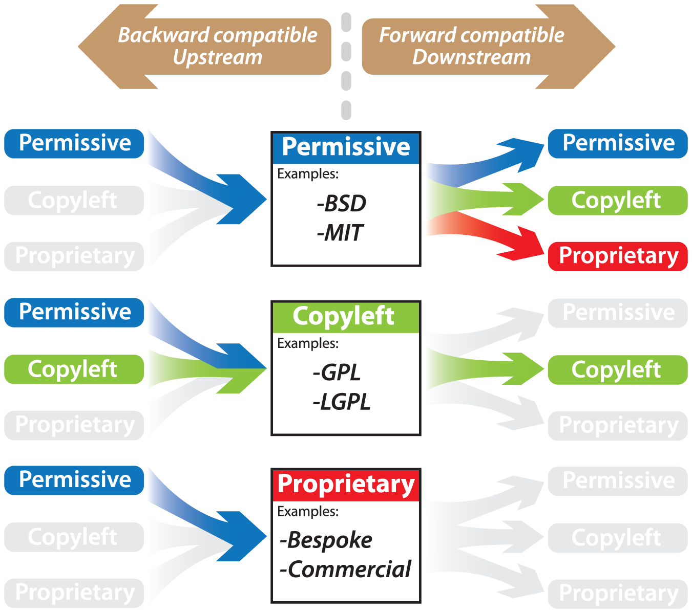

We need to identify which license best fits our current and future project needs. In order to do this we will research about different options available on open source licenses.

# Choose an Open Source License

## Why Software Licenses Are Important

Licenses are important tools for setting specific **terms on which software may be used, modified, and/or distributed**.

Based on the copyright protection automatically granted to all original works, a software license (basically **a set of formal permissions from the copyright holder**) may include specific "conditions" of use, and are an important part of the legally binding contract between licensor (the copyright owner of the code) and the recipient (the "licensee").

Without a license agreement, software may be left in a state of legal uncertainty in which **potential users may not know which limitations owners may want to enforce**, and **owners may leave themselves vulnerable to legal claims** or have difficulty controlling how their work is used.

## Types of Software Licenses

In brief, software licensing strategies can be divided into three categories: "proprietary," "free and open source," or a hybrid of the two.

- **Proprietary Licensing:** The primary purpose of a proprietary software license is to **limit the use of software according to the rights owner's business strategy**. They typically allow use of the software only for its stated purpose, often only on a single computer, forbid users from copying, redistributing, or altering the work, and specifically prohibit the creation of derivatives using parts of the work.

- **Free and Open Source Software (FOSS) Licensing:** Free and open source software (FOSS) represents a fundamentally different approach to software licensing. The primary intent of FOSS is to **maximize openness and minimize barriers** to software use, dissemination, and follow-on innovation.

- **Hybrid Software Licensing:** "Hybrid" (also called dual- or multi-licensing) is the result of combining a FOSS license with a proprietary "closed" license, in cases that software developers' needs are not well met by using exclusively one of the approaches mentioned above.

As our project is strongly oriented to the open source community, **we are going to focus only on FOSS licenses**.

## Elements Common To All Free and Open Source Licenses

All FOSS licenses grant free (as in freedom), open, and non-discriminatory access and rights to modify licensed software and associated source code. This means that:

- **Anyone can use** the software for any purpose.
- **Anyone can modify** the software's source code.
- **Anyone can redistribute** the software, in both original and modified form, to anyone else.

A common misconception is that FOSS is synonymous with "noncommercial", but in fact, by the two most influential definitions of FOSS ([FSF](https://www.fsf.org/) and [OSI](https://opensource.org/)), **"non-discriminatory" means that no category of user or distributor can be prohibited**, including for-profit commercial entities. So this way FOSS-licensed software can be, and regularly is, commercially exploited.

As the Free Software Foundation states in their website,

> "Free software" is a matter of liberty, not price. To understand the concept, you should think of "free" as in "free speech," not as in "free beer". We sometimes call it "libre software," borrowing the French or Spanish word for "free" as in freedom, to show we do not mean the software is gratis.

Thus, a program is free software if the program's users have **the four essential freedoms**:

- The freedom to run the program as you wish, for any purpose (freedom 0).
- The freedom to study how the program works, and change it so it does your computing as you wish (freedom 1). Access to the source code is a precondition for this.
- The freedom to redistribute copies so you can help others (freedom 2).
- The freedom to distribute copies of your modified versions to others (freedom 3). By doing this you can give the whole community a chance to benefit from your changes. Access to the source code is a precondition for this.-

Virtually all free and open source licenses also include a prominent **disclaimer of liability**, so that the licensor cannot be held responsible if the code (even in unmodified form) causes a recipient's computer to melt.

## Elements That Vary Across Open Source Licenses

In addition to the core freedoms described above, some open source licenses include some additional conditions. Usually these conditions place certain demands on the recipient, or constraints on the recipients' behavior, in exchange for the recipient's right to use and redistribute the code.

### Copyleft versus Permissive

"Copyleft" and "Permissive" are terms used to compare legal philosophies and attributes of FOSS licenses to traditional proprietary licenses.

- **Copyleft:** A license that **not only grants the freedoms** mentioned above but furthermore **requires that those freedoms apply to any derivative works**. Requiring as a condition of the license that any derivative works also be distributed under the same licensing terms as the original, these copyleft licensing terms are also sometimes referred to as reciprocity or "share-alike" provisions, and because of these reciprocity requirements, copyleft licenses are considered "restrictive" licenses, though these restrictions guarantee perpetual open access.

**Examples** of popular copyleft FOSS licenses include the **GNU General Public License (GPL)**, **GNU Lesser General Public License (LGPL)**, and the **Mozilla Public License (MPL)**. The GNU Licenses are the most well known of all the FOSS licenses and have a strong community of supporters and advocates. Of these, the GPL has the strongest reciprocity requirements and is considered a "strong" copyleft license. The LGPL (the "Lesser GPL," denoting its weaker copyleft requirements) is very similar to the GPL from which it is derived, but allows for linking to proprietary code under certain circumstances. Similarly, the MPL allows copyleft to be applied to some parts of the code and not others. The LGPL and MPL are considered a compromise between the strong copyleft of GPL and permissive licenses such as the BSD/MIT.

- **Permissive or non-copyleft:** A license that **grants the freedoms** mentioned above but that **does not have a clause requiring that they apply to derivative works as well**. Permissively licensed software may be incorporated into "closed" proprietary programs with no requirement that the source code be disclosed if the combined software is distributed.

**Examples** of popular permissive FOSS licenses include the **Berkeley Software Distribution (BSD)**, **MIT** and **Apache** licenses. The BSD and MIT licenses are often mentioned interchangeably due to very similar language and terms that accomplish largely identical goals. The primary intent of these licenses is to allow the use, distribution, and modification of your code for any purpose, while making sure that you as the creator receive credit for your work. The Apache license is similar in effect to the BSD/MIT, but include a license for patents related to the software (this can be desirable or not, depending on the situation).

Below is a list of licenses in descending order **from strong copyleft at the top to completely non-copyleft at the bottom**:

- **GNU Affero General Public License version 3** [AGPL-3.0](https://www.gnu.org/licenses/agpl.html)
- **GNU General Public License version 3** [GPL-3.0](https://www.gnu.org/licenses/gpl.html)
- **Mozilla Public License 2.0** [MPL-2.0](https://www.mozilla.org/MPL/)
- **GNU Library or "Lesser" General Public License version 3** [LGPL-3.0](https://www.gnu.org/licenses/lgpl.html)
- **MIT license** [MIT](https://opensource.org/licenses/MIT)
- **Apache License 2.0** [Apache-2.0](https://apache.org/licenses/LICENSE-2.0)
- **BSD 2-Clause ("Simplified" or "FreeBSD") license** [BSD-2-Clause](https://opensource.org/licenses/BSD-2-Clause)

### Permissions, conditions and limitations

Open source licenses grant the public **permissions to do things with licensed works** that copyright or other "intellectual property" laws would not otherwise permit. Most open source licenses grant permissions subject to **compliance with certain conditions**.

In addition to this, most open source licenses **also have limitations** that typically disclaim warranty and liability, and sometimes expressly exclude patents or trademarks from license grants.

For reference, here is a table of every license mentioned above.

|                                                    **License**                                                    | **Commercial use** | **Distribution** | **Modification** | **Patent use** | **Private use** | **Disclose source** | **License and copyright notice** | **Network use is distribution** | **Same license** | **State changes** | **Liability** | **Trademark use** | **Warranty** |
| :---------------------------------------------------------------------------------------------------------------: | :----------------: | :--------------: | :--------------: | :------------: | :-------------: | :-----------------: | :------------------------------: | :-----------------------------: | :--------------: | :---------------: | :-----------: | :---------------: | :----------: |
|        **GNU Affero General Public License version 3** [AGPL-3.0](https://www.gnu.org/licenses/agpl.html)         |         ✓          |        ✓         |        ✓         |       ✓        |        ✓        |          ✓          |                ✓                 |                ✓                |        ✓         |         ✓         |       ✓       |                   |      ✓       |
|                   **Apache License 2.0** [Apache-2.0](https://apache.org/licenses/LICENSE-2.0)                    |         ✓          |        ✓         |        ✓         |       ✓        |        ✓        |                     |                ✓                 |                                 |                  |         ✓         |       ✓       |                   |      ✓       |
| **BSD 2-Clause ("Simplified" or "FreeBSD") license** [BSD-2-Clause](https://opensource.org/licenses/BSD-2-Clause) |         ✓          |        ✓         |        ✓         |                |        ✓        |                     |                ✓                 |                                 |                  |                   |       ✓       |                   |      ✓       |
|             **GNU General Public License version 3** [GPL-3.0](https://www.gnu.org/licenses/gpl.html)             |         ✓          |        ✓         |        ✓         |       ✓        |        ✓        |          ✓          |                ✓                 |                                 |        ✓         |         ✓         |       ✓       |                   |      ✓       |
|  **GNU Library or "Lesser" General Public License version 3** [LGPL-3.0](https://www.gnu.org/licenses/lgpl.html)  |         ✓          |        ✓         |        ✓         |       ✓        |        ✓        |          ✓          |                ✓                 |                                 |        ✓         |         ✓         |       ✓       |                   |      ✓       |
|                            **MIT license** [MIT](https://opensource.org/licenses/MIT)                             |         ✓          |        ✓         |        ✓         |                |        ✓        |                     |                ✓                 |                                 |                  |                   |       ✓       |                   |      ✓       |
|                      **Mozilla Public License 2.0** [MPL-2.0](https://www.mozilla.org/MPL/)                       |         ✓          |        ✓         |        ✓         |       ✓        |        ✓        |          ✓          |                ✓                 |                                 |        ✓         |                   |       ✓       |         ✓         |      ✓       |

> #### LEGEND:
>
> **Commercial use:** The licensed material and derivatives may be used for commercial purposes.
>
> **Distribution:** The licensed material may be distributed.
>
> **Modification:** The licensed material may be modified.
>
> **Patent use:** This license provides an express grant of patent rights from contributors.
>
> **Private use:** The licensed material may be used and modified in private.
>
> **Disclose source:** Source code must be made available when the licensed material is distributed.
>
> **License and copyright notice:** A copy of the license and copyright notice must be included with the licensed material.
>
> **Network use is distribution:** Users who interact with the licensed material via network are given the right to receive a copy of the source code.
>
> **Same license:** Modifications must be released under the same license when distributing the licensed material. In some cases a similar or related license may be used.
>
> **State changes:** Changes made to the licensed material must be documented.
>
> **Liability:** This license includes a limitation of liability.
>
> **Trademark use:** This license explicitly states that it does NOT grant trademark rights, even though licenses without such a statement probably do not grant any implicit trademark rights.
>
> **Warranty:** This license explicitly states that it does NOT provide any warranty.

## Our process to choose the license for Boken Engine

### Measuring popularity

The first thing we did was to know a little bit more about the **adoption of popular licenses** mentioned above. The results were the following:

- In **2015**, according to a internal research from GitHub about license usage on GitHub.com, **MIT** (almost 45% of projects), **GNU Public Licenses** (almost 25%) and **Apache** (more than 11%) are the **clear front runners**, with some 15% of licensed projects opting for a non-standard license or standard license not among those listed on choosealicense.com.

Developers use GitHub because they want to share their code with the world, and the data suggests that when the tools GitHub provides make it a little bit easier, developers do just that. When presented with the option, they choose to license, and they license very permissively.

- An external research of **trends from 2018 to 2020** (excluding repositories that do not have a license file) got the following conclusions:
  - Over **half** of the repositories use either the **Apache 2.0 or MIT** license
  - **One third** of repositories use some form of **custom license** text.
  - The remaining 13% contain a large variety of licenses of which the BSD and variations of the GNU Public Licenses are the most common.

An interesting finding was that **a sizeable number of repositories still used the older versions of the BSD and GPL licenses**. In summary across 2018 and 2019:

- 352 repositories use BSD 2 and 1,562 use the newer BSD 3
- 841 repositories use GPL 2.0 and **2,114 use GPL 3.0**

The data also suggests that **many individual contributors do not understand the importance of including a license** file in the projects they open source.

- A more **recent research** show some latest trends:
  - **Apache 2.0 license takes the lead** at the expense of MIT license.
  - In general, the use of **permissive open source licenses continues to rise**. The preference is for licenses with fewer restrictions and limitations.
  - Usage of **copyleft licenses**, especially GPL licenses, continues to **decrease**.

### Going permissive at first

The first option was to choose the **MIT license as a way to start from a blank slate**, just have a license and continue working. MIT license is short, very easy to understand, and allows anyone to do anything so long as they keep a copy of the license, including your copyright notice. You will be able to release the project under a different license if you ever need to. **Based on the same flexibility that MIT provides, another option was Apache 2.0**.

After that we realized that was better to invest some time in thinking about the implications it might have in the future. **Having an almost "do whatever you want" license could have some undesirable side effects**.

### Maintaining freedom through restrictions

Although a **permissive license** may seem ideal because of the freedom it provides, both for the creator of the software and the user, at the same time it also provides the freedom to the latter to modify and distribute it under different terms and without source code. That means this piece of **source code could be easily (and legally) turned into a close source software** (proprietary program) without the obligation of sharing it, which in the end weakens the open source community.

> Schematic representation of license directionality, from [A Quick Guide to Software Licensing for the Scientist-Programmer](https://journals.plos.org/ploscompbiol/article?id=10.1371/journal.pcbi.1002598), © Morin et al.

> In general, permissively licensed code is forward compatible with any other license type. However, only permissive licenses, such as the BSD and MIT, can feed into other permissive licenses. Restrictive licenses like the GPL are backward compatible with themselves and permissive licenses, but must adopt the restrictive license from then on. Proprietary licenses can incorporate upstream permissively licensed code, but by definition are incompatible with any other downstream license. Grey represents actions that are not permitted without negotiating a separate license agreement with the rights owner.

Proprietary software developers have the advantage of money; free software developers need to make advantages for each other. **Using strong copyleft licenses for a code instead of permissive and some weak copyleft licenses gives free software developers an advantage over proprietary developers**: a code that they can use, while proprietary developers cannot use it.

Proprietary software developers, seeking to deny the free competition an important advantage, will try to convince authors not to contribute to strong copyleft libraries. For example, they may appeal to the ego, promising "more users for this library" if we let them use the code in proprietary software products. Popularity is tempting, and it is easy for a library developer to rationalize the idea that boosting the popularity of that one library is what the community needs above all.

In our particular case **we want to make sure our framework remains free software for all its users** so we start considering the different options for copyleft licenses.

We considered **Creative Commons licenses** (in particular the Attribution-ShareAlike 4.0 International (CC BY-SA 4.0)) but quickly found many sources that advised against it. Even the [Creative Commons organization itself advises against using CC licenses for software](https://creativecommons.org/faq/#can-i-apply-a-creative-commons-license-to-software), and actually they use free and open source software licenses for their own software.

Some of the main arguments against using it are the following:

- Unlike software-specific licenses, CC licenses do not contain specific terms about the distribution of source code.
- CC licenses are currently not compatible with the major software licenses, so it would be difficult to integrate CC-licensed work with other free software.

Among the list of FOSS licenses, the **GNU GPLv3 lets people do almost anything they want with your project, except distributing closed source versions**. And this seemed to be like an ideal fit for our intentions.

In brief, GNU GPLv3 estipulates that **permissions** of the license are **conditioned on making available complete source code of licensed works and modifications**, which include larger works using a licensed work, **under the same license**. Copyright and license notices must be preserved. Contributors provide an express grant of patent rights.

### A slightly step back

We were almost decided to go for GNU GPL license for our project, but then we got some information about the fact that **creating a framework to build iOS applications with this license could turn in some legal troubles**. After doing additional research we found some cases of conflicts on publishing Open Source software on Apple's App Store. Basically the matter is that **Apple's App Store terms of service impose extra restrictions** which are, by nature, incompatible with the GPL.

So we started to think about **other alternatives**: LGPL, Dual licensing, etc. but the line between legal and problematic was starting to get thinner and crossing it (even unintentionally) could harm the project.

After that we analise the **Mozilla Public License 2.0 (MPL-2.0)**, which is a **weak copyleft license**, providing a middle ground between the liberal MIT/BSD/Apache licenses and the GPL licenses. In addition is, by default, compatible with LGPL and GPL version 2 or greater.

In fact, **others have also opted for this license after facing the same problems with Apple App Store and GPL licensed source code** we mentioned above. The most significant case was VLC, pulled in from App Store due to a licensing dispute caused by the fact that all versions of VLC were then open-source and licensed under GNU General Public License (GPL) version 2. Subsequent VLC version for iOS was licensed under both the Mozilla Public License 2.0 as well as the GNU General Public License version 2 (or later) so the MPL-2.0 version of the software was applicable for distribution on the App Store again.

Some of the **features** and **requirements** of this license are:

- Permissions of this license are conditioned on **making available source code of licensed files and modifications of those files under the same license** (or in certain cases, one of the GNU licenses.
- **Copyright and license notices must be preserved**.
- **Contributors provide an express grant of patent rights**.
- However, a **larger work** using the licensed work **may be distributed under different terms and without source code for files added** in the larger work.
- The **license notice** must be in some way **"attached" to each file**.

As mentioned above, license makes it really easy to incorporate the code into larger works, but it is very interesting to consider some things if you plan to to this.

An important point here is the "larger works" part: The MPL-2.0, section 3.3, permits anyone to combine original source code with code under the GNU General Public License (GPL) version 2, or any later version of that license, to make a Larger Work, and distribute the result under the GPL. The only condition is that you must also make the original source code, and any changes you have made to it, available to recipients under the terms of the MPL-2.0 also.

Anyone who receives the combined code (dual licensed as MPL/GPL) from you does not have to continue to dual licence in this way, and may, if they wish, distribute the program as a whole under the terms of the chosen GNU license, but the MPL-covered files will be dual-licensed, so that recipients can choose to distribute them under that GNU License or the MPL. However, some creators of MPL licensed software discourage people from distributing copies of the original source code under the GPL alone, because it means that any improvements they make cannot be reincorporated into the main version of the original source code. There is never a need to do this for license compatibility reasons. Other creators choose to opt out of this GPL compatibility in advance by adding a notice to its header source files.

On the other hand, the fact that it does not automatically extend to other files within the same project makes it easy to extend a library without releasing the relevant additions neccesary as free software, as long as the MPL-licensed components remain accessible under the terms of the MPL.

By allowing proprietary modules in derived projects while requiring core files to remain open source, the **MPL is designed to motivate both businesses and the open-source community to help develop core software**.

That said, **we opt for Mozilla Public License 2.0 (MPL-2.0)**, mainly because of its **versatility and compatibility** with other licenses. The known cases of going back from GPL to MPL to allow the publication on Apple's App Store are also a strong reason to take this decision.

For all these reasons **we consider MPL-2.0 as the best option for our project** at this moment.

---

#### **How to include license on source code**

To apply the Mozilla Public License to software that we have written, we have to **add the header from Exhibit A of the license to each source code file** in our project.

[This page](https://www.mozilla.org/en-US/MPL/headers/) gives copy-and-pasteable license headers for Mozilla code. When adding license headers to new files always we have to use the appropriate one of the suggested there. As a reference here is the raw text.

> This Source Code Form is subject to the terms of the Mozilla Public License, v. 2.0. If a copy of the MPL was not distributed with this file, You can obtain one at https://mozilla.org/MPL/2.0/.

**This license text must be used for all new code**, unless the containing project, module or externally-imported codebase uses a different license. If we can not put a header in the file due to its structure, we could put it in a LICENSE file in the same directory. However, while the license permits putting the header somewhere other than the file itself, individual files often end up being distributed on their own, without the rest of the software they were authored with. As a result, putting the license notice in the file is the surest way to ensure that recipients are always notified, so **we strongly encourage to do so as far as possible**.

We may also add additional accurate notices of copyright ownership, such as the name of the copyright holder, although this is not necessary.

As the project is initially released, **a "Copyright [TBD]Copyright Holder" notice is required in the headers of all source files**. New files added should also include a license header with a "[TBD]Copyright Holder" copyright notice, whether the file is created by internal or external developer.

From a legal perspective, **leaving "[TBD]Copyright Holder" in the headers does not affect the contributors' rights**. Most contributors do not care about this, especially for small patches. **By default, contributors (or their employers) hold copyright on their contributions**, whether or not we note that publicly, and the commit log is the most accurate record of their work. But it is reasonable to want special public credit for your work. To that end, contributors may be recognized **creating and maintaining AUTHORS and CONTRIBUTORS files**. This requires ongoing maintenance but builds goodwill among our contributors.

When project start accepting a great deal of external code, **we may wish to optionally update the copyright statements** in our source code to a generic "Copyright 2021 The Boken Authors" also **to acknowledge the community's efforts**.

Rather than attempting to modify the headers for the project to list every single contributor, **we can follow these steps to create additional visibility for contributor acknowledgment**. Again, the **git history will be the best source of truth as to copyright ownership** for each contribution.

1. Update the copyright statements in our LICENSE file and all file headers to list "The Boken Authors" rather than "[TBD]Copyright Holder":

- Before: Copyright 2021 [TBD]Copyright Holder
- After: Copyright 2021 The Boken Authors.

2. Create a top-level file named AUTHORS, which will identify the copyright holders of the project.

> This is an list of people who have contributed to the codebase which lives in this repository.
>
> [TBD]Copyright Holder
>
> Ada Lovelace
>
> Alan Turing
>
> ...

It is not necessary to proactively list the contributor for every single contribution we receive. Rather, it is sufficient to add contributors when they request to be added. **Adding contributors to the AUTHORS file** is entirely within the project's discretion and **has no implications for copyright ownership**.

---

#### **Note about Copyright and copyleft**

From [GNU site](https://www.gnu.org/licenses/copyleft.en.html)

> To copyleft a program, we first state that it is copyrighted; then we add distribution terms, which are a legal instrument that gives everyone the rights to use, modify, and redistribute the program's code, or any program derived from it, but only if the distribution terms are unchanged. Thus, the code and the freedoms become legally inseparable.
>
> Proprietary software developers use copyright to take away the users' freedom; we use copyright to guarantee their freedom. That's why we reverse the name, changing "copyright" into "copyleft."
>
> Copyleft is a way of using the copyright on the program. It doesn't mean abandoning the copyright; in fact, doing so would make copyleft impossible. The "left" in "copyleft" is not a reference to the verb "to leave"—only to the direction which is the mirror image of "right".

# Sources

- [Choose an open source license](https://choosealicense.com/licenses/)
- [Free-software license](https://en.wikipedia.org/wiki/Free-software_license)
- [Open Source Archetypes: A framework For Purposeful Open Source](https://blog.mozilla.org/wp-content/uploads/2018/05/MZOTS_OS_Archetypes_report_ext_scr.pdf)
- [A Quick Guide to Software Licensing for the Scientist-Programmer
  ](https://journals.plos.org/ploscompbiol/article?id=10.1371/journal.pcbi.1002598)
- [About Open Source Licenses](https://opensource.org/licenses/)
- [Licence differentiator](http://oss-watch.ac.uk/apps/licdiff/)
- [The Legal Side of Open Source](https://opensource.guide/legal/)
- [History of copyright](https://en.wikipedia.org/wiki/History_of_copyright)
- [Producing Open Source Software. How to Run a Successful Free Software Project](https://producingoss.com/en/legal.html)
- [Open source license usage on GitHub.com](https://github.blog/2015-03-09-open-source-license-usage-on-github-com/)
- [Examining Open Source License Usage](https://solutionshub.epam.com/blog/post/examining-open-source-license-usage)
- [The Rise of Open Source](https://solutionshub.epam.com/rise-of-open-source)
- [Open Source Licenses in 2021: Trends and Predictions](https://resources.whitesourcesoftware.com/blog-whitesource/open-source-licenses-trends-and-predictions)
- [Pick a License, Any License](https://blog.codinghorror.com/pick-a-license-any-license/)
- [Why is CC BY-SA discouraged for code?](https://opensource.stackexchange.com/questions/1717/why-is-cc-by-sa-discouraged-for-code)
- [CC license selection tool on GitHub](https://github.com/creativecommons/chooser)
- [Non-Software Licenses](https://choosealicense.com/non-software/)
- [GPL-Compatible Free Software Licenses](https://www.gnu.org/licenses/license-list.en.html#GPLCompatibleLicenses)
- [Frequently Asked Questions about the GNU Licenses](https://www.gnu.org/licenses/gpl-faq.en.html)
- [How to use GNU licenses for your own software](https://www.gnu.org/licenses/gpl-howto.en.html)
- [Why you shouldn't use the Lesser GPL for your next library](https://www.gnu.org/licenses/why-not-lgpl.en.html)
- [Apple picks death not compliance for open source iPhone game](https://www.theregister.com/2010/05/27/gnu_go_fsf_apple_itunes/)
- [GPL Enforcement in Apple's App Store](https://www.fsf.org/news/2010-05-app-store-compliance)
- [More about the App Store GPL Enforcement](https://www.fsf.org/blogs/licensing/more-about-the-app-store-gpl-enforcement)
- [The GPL, the App Store, and you](https://www.engadget.com/2011-01-09-the-gpl-the-app-store-and-you.html)
- [No GPL Apps for Apple's App Store](https://www.zdnet.com/article/no-gpl-apps-for-apples-app-store/)
- [Does apple approve GPL based apps?](https://developer.apple.com/forums/thread/18922?answerId=59184022#59184022)
- [Picking an OSS license for your iOS app](https://blog.lazerwalker.com/cortado/2015/07/05/open-source-licenses.html)
- [How to avoid public GPL floggings on Apple's App Store](https://www.zdnet.com/article/how-to-avoid-public-gpl-floggings-on-apples-app-store/)
- [Comparison of free and open-source software licences](https://en.wikipedia.org/wiki/Comparison_of_free_and_open-source_software_licences)
- [What are the essential differences between the BSD and MIT licences?](https://opensource.stackexchange.com/a/582)
- [What you need to know to choose an open source license.](https://gist.github.com/nicolasdao/a7adda51f2f185e8d2700e1573d8a633#in-a-nutshell)
- [Facebook relicensing React, Jest, Flow, and Immutable.js](https://engineering.fb.com/2017/09/22/web/relicensing-react-jest-flow-and-immutable-js/)
- [Reactions to Facebook change license to React from BSD to MIT on GitHub repository](https://github.com/facebook/react/commit/b765fb25ebc6e53bb8de2496d2828d9d01c2774b)
- [Apache License v2.0 and GPL Compatibility](https://www.apache.org/licenses/GPL-compatibility.html)
- [Fedora Project - Licensing](https://fedoraproject.org/wiki/Licensing:Main)
- [Mozilla Public License Version 2.0](https://mozilla.org/MPL/2.0/)
- [The Mozilla Public License Version 2.0: A Good Middle Ground?](https://julien.ponge.org/blog/mozilla-public-license-v2-a-good-middleground/)
- [Developer’s Guide to Open Source Licenses](https://www.toptal.com/open-source/developers-guide-to-open-source-licenses)
- [Mozilla License Headers](https://www.mozilla.org/en-US/MPL/headers/)
- [VLC media player returns to the iOS App Store after 30-month hiatus](https://arstechnica.com/gadgets/2013/07/vlc-media-player-returns-to-the-ios-app-store-after-30-month-hiatus/)
- [Combining MPL-Licensed files with an (L)GPL-Licensed Project: Guidelines for Developers](https://www.mozilla.org/en-US/MPL/2.0/combining-mpl-and-gpl/)
- [Google's open source - Contributions copyright](https://opensource.google/docs/releasing/contributions/#copyright)
- [The Linux Foundation - Copyright Notices in Open Source Software Projects](https://www.linuxfoundation.org/en/blog/copyright-notices-in-open-source-software-projects/)
- [Google's open source - AUTHORS File](https://opensource.google/docs/releasing/authors/)
