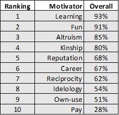
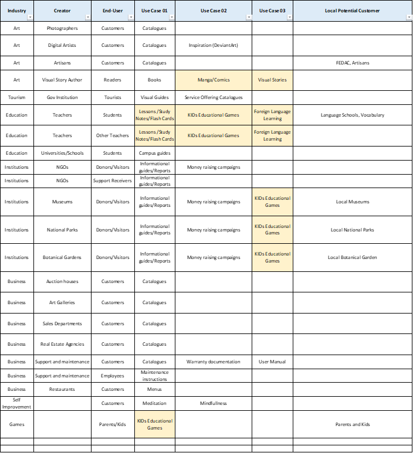
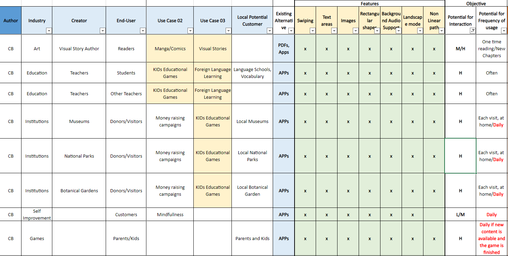
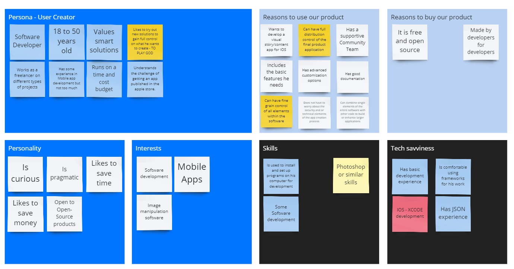
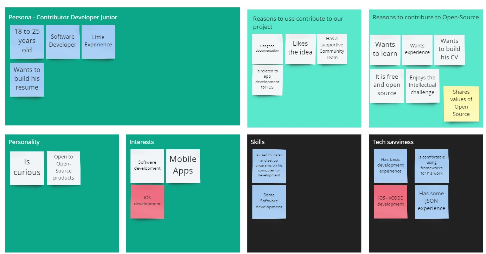
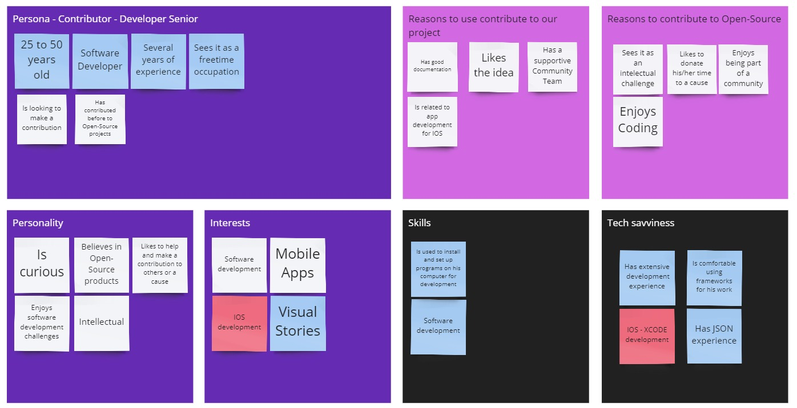
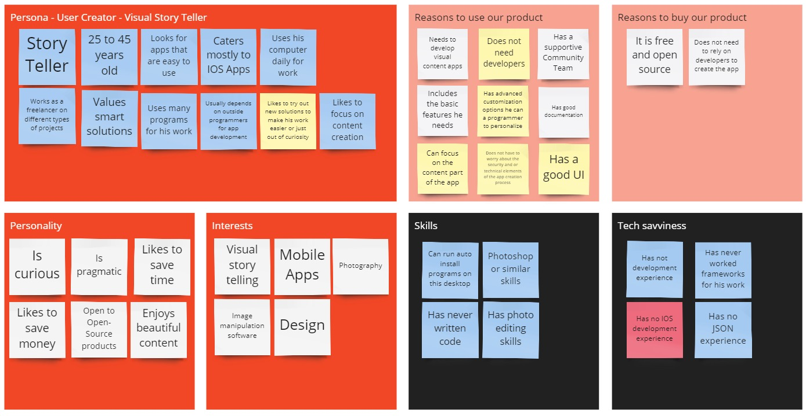
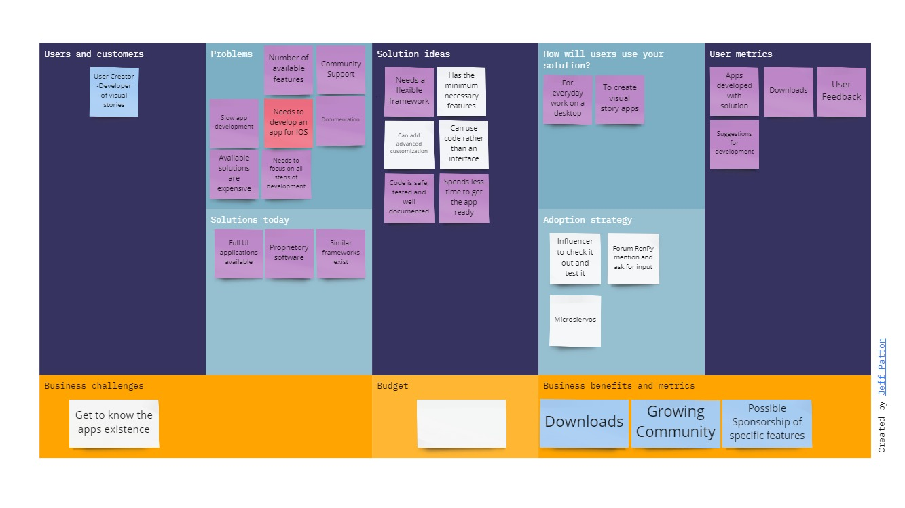
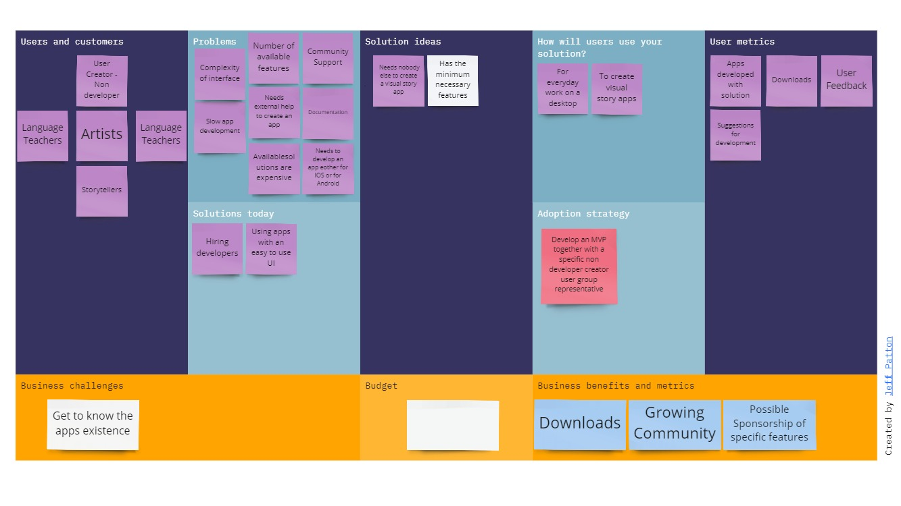

<h2> 1.2.1 Stakeholder Communities around the Open-Source Project</h2>

The stakeholder communities that will naturally evolve around the Open-Source Project belong essentially to these three broad groups:
- Contributors
- User Creators
- End-users or end-product consumers

<h3>Contributors</h3>
The contributors can be divided into the following subgroups:

- Contributors of funds  
- Contributors of time, expertise, and feedback  
-    - Open-Source Community Core Team (HYVE)  
-    - External Designers  
-    - External Developers  
-    - External – Non-Developers such as users, translators, etc.  
- User Creators - Feedback  
- End-Users or End-Consumers - Feedback  
 
<h3>Contributors of Funds</h3>
Are the companies that will be interested to support financially the Open-Source Project.

<h3>Contributors of Time, Expertise and Feedback</h3>
The contributors of time, expertise and feedback will be those who will actively contribute grow, develop, and improve the project’s software.

<h3>User Creators</h3>
Are the users who will actively use the open-source software from the project to create content for end users.

<h3>End-Users or End-consumers</h3>
They are the users and consumers of the content created with our project’s software by the User Creators.``

<h2>Motivations of Contributors in Open-Source Software Projects</h2>
The motivations to contribute to Open Source (OSS) Software projects are quite different and are the following as portrayed in the paper “Carrots and Rainbows: Motivation and Social Practice in OSS Development” by von Krogh, et. Al, 2012.

Such motivations can be group into the following main categories:
1.	Intrinsic motivations (performed for the inherent joy of participating and contributing)
   a.	Ideology: The believe and commitment to the purpose and nature of OSS: free to modify, etc. 
   b.	Altruism: A voluntary contribution that does good, is an end in itself and is not directed at 
        gain. 
   c.	Kinship amity: Urge of people to help others in a community that they belong to.
   d.	Enjoyment and fun: The playfulness and experimentation possibilities when contributing.
2.	Internalized Extrinsic Motivation (performed with an external result or purpose linked in a way to the project)
   a.	Reputation: Refers to the reputation that is obtained through contributions made to a project 
        that can be divided into peer reputation (within the community) and outside reputation (friends, 
        relatives, and prestige awarded).
   b.	Gift Economy/Reciprocity: Giving code in return for other code.
   c.	Learning: The motive to improve or acquire new skills through OSS. 
   d.	Own – Use Value: When the OSS has direct user value for the contributors.
3.	Extrinsic (performed with a separable outcome not linked to the project)
   a.	Career: When they want to signal their talent for all to see and inspect in hopes for new job opportunities.
   b.	Pay: Up to 40% of contributors is paid to contribute to OSS projects in some studies.

According to “Shifting Sands of Motivation: Revisiting What drives Contributors in Open Source” by Gerosa, et al.  (2021) the most prevalent motivators to contribute to OSS are:

The most frequent reason to contribute being Learning, Fun, Altruism and Kinship.  However, these authors made a point in their study that these shifted depending both on the demographics as well as the experience with OSS projects.

<h3>Early-Stage and Late-Stage Motivators</h3>
According to the “Shifting Sands of Motivation: Revisiting What drives Contributors in Open Source” by Gerosa, et al.  (2021), motivations differ depending on your profile, demographics, your experience, and your interest will shift over time.

One of the reasons can be attached to the fact that today OSS enjoys a place of distinction in producing key technologies, bringing new learning and career opportunities to contributors but also OSS projects. Companies look at OSS project to find new talent.
 
According to the authors there are considerable differences between novice contributors with few years contributing to OSS and the more experienced contributors whose motivation shifted from some motivators to others, specifically extrinsic motivators shifting to intrinsic.  

Novice OSS contributors for example were much likelier to join an OSS projects for learning purposes, fun, reputation, and career.

More experienced OSS contributors though clearly displayed greater motivation for social and altruistic reasons as well as their ideology which were motivators for them to continue adding to OSS projects.

<h2>1.2.2 Core Team’s Scope of Influence</h2>
At the beginning our core team’s reach will be that of the different communities of contributors, as well as that of the User Creators who will actively use the software to develop their ideas and create content. 

We will have no control over the content that is created with our software and hence will focus our attention on catering to the Contributor group and that of the User Creators.

Therefore, as mentioned in our basic best practices research, we will have to focus on specific points to lower the Contributor and User Creator entry barriers to our project and take into consideration the different motivations of these groups for contributing to or using our project’s software. 

Further questions to explore will be the elements for intrinsic and extrinsic motivations that make people contribute to an open-source project as well as the benefits that they derive from this. 

<h3>Current State of the Software Framework </h2>
The current software can be described in one sentence as:

“Framework to create non-linear, slide-driven visual stories for IOS.”
The current features can be summed up as the following:

1.	Story contents described by a comprehensible JSON file.
2.	Decoupled architecture: no mess with code required.
3.	Extensible and customizable for advanced users.
4.	No configuration or customization needed: just the story contents and its assets are enough to create the app.
5.	Create your content with text areas, images, and rectangular shapes.
6.	Contents auto adjusted to device screen size.
7.	Background and scene-specific audio support.
8.	Gestures (swipes) support
9.	Landscape mode ready.

The current user creator would have to download, install, and create content with it resulting in an independent app that would then have to be sent in, to the Apple Store for approval and listing.

<h3>User Creator Entry and Usage Barrier</h3>
At the current state of the software the User Creators profile requires a higher-than-average computer knowledge to install and run the software to create content apps with it.

In addition, it does not allow to pre customize such settings or create templates without technical knowledge thus it can result a repetitive task, each time new content is to be created.

<h3>User Creators Listing Barriers</h3>
Even though unrelated to our software it is a reality that we have experienced ourselves and an area we will have to explore more once we design our demo project.

It is a fact that if one’s app does not meet the Apple Store’s minimum requirements of content value for to end-users, the app will not get listed no matter how good and safe it is technically, so that we will have to learn ourselves from this exercise and then document it too for the community to help them achieve the goal of getting their application listed. 

<h2>1.2.3 Creation of Value for the User Creators vs Creation of Value for End-Users</h2>
The value that each type of user derives from our software are different since each group has different goals and objectives when using it.

<h3>User Creators Value</h3>
If we look at the User Creators, we first need to address the following questions to better understand this stakeholder.

Some questions to ask when looking at the User Creators:

- •	What creates value for the User Creators?
- •	Which needs does he/she have?
- •	What problems does he normally face? 
- •	What would drive them to use our framework?
- •	Which are the features that our product would need to include to become even more attractive?

<h3>End User Value</h3>
The value that is generated for the End Users is to a great extent tied to the content of any applications that will be created with the help of our software. Given this, we must differentiate between what we can affect and what we cannot affect. The content for example will be dependent on the ideas of each of our User Creators.

Things that we can affect and control to some extent are:

- •	Simple to use user interface.
- •	User customization options.
- •	Range of possible features that are available for the use of the application.

<h3>Potential Use Cases of the Project’s Software</h3>
We did different thought exercises both individually as well as groups to come up with a list of potential use cases for the software asking the following questions:

1. A.	What are obvious possible use cases at the current state of the software?
2. B.	What are the possible use cases with a few additional features to create everyday usage and value?
3. C.	What app would we create to provide daily direct value for someone like us?

Hereafter we consider these use cases from a different perspective of value creation and went through a set of questions to establish the most feasible. 

- •	Are there currently better options for the same purpose?
- •	Would we use it as creators?
- •	Would we use it as end users?
- •	What benefit would we derive from it?
- •	Would it be difficult to be used?
- •	Do the current features justify it to be a native app rather than a website? If not, which features are needed?

<h4>Exercise A: What are the possible use cases at the current state of the software?
The initial brainstorming’s use cases resulted in the following list:</h4>

As of right now from going over this list one can infer that many of the possible use cases are already served by other existing non app related technologies, such as PDF or websites. The creation of catalogues, maintenance instructions do not take advantage of the nonlinear nor sound features of our product.

Which would leave the following initial use case list as the likelier ones making use of most of the current features and with a potential frequent to high usage and interaction.

<h4>Exercise B: What are the possible use cases with a few additional features to create everyday usage and value?</h4>
Some additional features that could drive additional value and increase usage rate would be for example:

- •	Notifications: Updates of new content availability for download, reminders for study, etc.
- •	Marking pages to easily go back to them: Quickly and easily go back to a location or save the content for later review.
- •	Uploading new content in the app: Possibility to expand the content easily without having to install a new app.
- •	Menu & Index: Better overview of available content, trial content, marked pages, etc.
- •	Possibility to buy additional content through the app: Content from the same app author.

These additional features also expand the use case possibilities for our software.
Questions resulting from these possible features are:

- •	Can they easily be implemented?
- •	Which will provide the highest return through the least effort?

<h4>Exercise C: What app would we create to provide daily direct value for someone like us using this software or slightly amplifying it?</h4>

Keeping in mind the following questions we proceeded to consider a slightly broader range of application use cases:

- •	What could we create that could generate daily value for the end-user with this software?
- •	What generates value for the User Creator?
- •	What generates value for the User Creator or content creator?
- •	Are there currently better options for the same purpose?
- •	Would we use it as creators?
- •	Would we use it as end users?
- •	What benefit would we derive from it?
- •	Would it be difficult to be used?
- •	What other apps exist that do something similar?
- •	Do the current features justify it to be a native app rather than a website? If not, which features are needed?

<b>Value increase for User Creators (Content Creators)</b>

- •	A UI for visually editing, or at least aiding, on the creation of the content description JSON would add significant value to the application, as it would reduce the errors when editing it and would speed up the content creation, as the creator would not have to “try” position and scale values. Although this is a feature aimed directly to the content creator, I would generate also indirect benefit to the end-user, as it would increase the repository of available applications.
- •	Additionally, an automation system to completely create the final App with no need for writing code would increase the value of the App. Combined with the previously commented content creation UI, would offer the user a fully visual app creation from end to end. This system would imply automatic code generation and building in a back-end using the XCode commands, increasing the engine complexity.
- •	Also, additional elements would be very useful for both content creators and end-user to increase the appeal of the final applications. Some examples would be video elements, animated GIFs or standard symbols. Also, increasing the possibilities of currently supported elements would be very interesting (i.e. Selecting font families or adjusting image lightness)

**Would we use it as creators?**
- •	A trained developer would not a visual interface, since for him it would be easier to create the final content using directly the XCode features.

**Would we use it as end user?**
- •	If the created content is interesting enough, of course. It depends completely on the content.

**Are there currently better options for the same purpose? What other apps exist that do something similar?**
- •	There are plenty of similar Apps with an integrated UI, like this, this or this. The main difference is that Boken Engine is a source code framework (not a standalone application) that is integrated in a host application, and therefore can be a part of a broader project. However, there are other libraries for a similar purpose, like the extremely popular Ren’Py.

**What benefit would we derive from it?**
- •	The main interest a developer could have to use it, instead of using easier alternatives, is that, as stated previously, this can be integrated in a huge application, and as it has a decoupled and open architecture, can be mixed up with other libraries and frameworks to achieve a more powerful visual narrative application than use it individually. For example a developer can use only a part of it (i.e. only the SceneManager and StoryParser, but construct the slides themselves with another engine) or combine some of its features with the features of other libraries, or extend/modify it depending on his/her necessities.

**Do the current features justify it to be a native app rather than a website?**
- •	The current features don’t justify being a native app, but future developments could add some features very difficult to achieve via website (even PWAs).

<h2>1.2.4 Personas within Our Scope of Influence</h2>

Taking into consideration the different use cases and the current state of the software we tried to create a simplified overview of the four potential personas. Three current and one potential future user if the app were completely upgraded. 
At this point in time we perceive developers to be the main objective users as well as contributors until the project gains traction.
 
In addition to this we also created the other extreme of the potential user in the future of a finished app made for Visual User Stories to get a first insight into the requirements that may have to be met and developed in the future and which need to be included in a road map.

<h3>Potential user of the current software<h3>

<h3>Potential contributors to the project at this stage</h3>

<h2>1.2.5 Opportunity Canvas</h2>

**Current state of the Software**

**Potential future state of the software**
